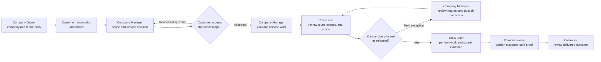

# Minimal Product User Workflow

Status: active design discovery  
Decision owner: product/design  
Last updated: 2026-09-08

## Purpose

Define the smallest coherent Grover service workflow before revising more
screens or adopting the minimalist prototypes into React. This document is the
source of truth for who participates in the minimal product, what each person
is trying to accomplish, how responsibility moves between them, and which
questions still require user evidence.

This workflow is intentionally separate from:

- the [minimalist persona prototype plan](minimalist-persona-prototype-plan.md),
  which explores a useful experience for every eventual persona;
- the [functional-unit rollout](all-persona-minimal-rollout-plan.md), which
  controls when implemented capabilities may be enabled; and
- production authorization and persistence contracts, which remain
  authoritative regardless of the design shown here.

## Minimal-product scope decision

Dispatcher and Crew Member do not participate in the minimal-product workflow.
Their completed prototypes remain future design evidence; they are not deleted,
treated as current MVP requirements, or used to justify production authority.

The minimal product assumes that a Company Owner or Company Manager performs
planning and coordination, and that a Crew Lead owns field execution. A future
phase may split planning into a Dispatcher experience and field tasks into a
Crew Member experience after the core workflow is understood and validated.

| Participation | Persona | Role in the workflow |
| --- | --- | --- |
| Core | Yard Owner | Establish the service relationship, make bounded decisions, prepare for service, and understand the delivered outcome |
| Core | Company Owner | Establish company and team readiness and resolve owner-level blockers |
| Core | Company Manager | Coordinate customer work, create the operating plan, release service, and review delivery |
| Core | Crew Lead | Execute the released work, manage field exceptions, and submit completion evidence |
| Alternate customer path | Property Manager | Perform customer decisions and review proof across authorized properties |
| Exception path | Support Administrator | Enter only through an owned incident with exact scope and purpose |
| Access guardrail | Team Member without an active role | Resolve invitation or account access without loading protected workspace data |
| Adjacent, product-gated | Billing Administrator | Review completion readiness only if the backend role and downstream operating process are approved |
| Deferred | Dispatcher | Eventually separate day-plan publishability and crew-capacity coordination from Company Manager |
| Deferred | Crew Member | Eventually separate individually assigned field tasks from Crew Lead coordination |

Property Manager is an alternate customer actor, not an additional step in a
Yard Owner journey. Support and no-role access are exception paths, not stages
that every user must traverse. Billing readiness follows delivered work but is
not required to prove the initial customer-to-service-to-proof loop.

## Design evidence language

Every item in this document must use one of these labels during review:

| Label | Meaning |
| --- | --- |
| Observed | Supported by a user interview, usability session, operating record, or current-product behavior |
| Hypothesis | Plausible design direction that still needs direct user evidence |
| Constraint | Required by an accepted product, authorization, privacy, or persistence boundary |
| Decision | Explicitly accepted scope or behavior |
| Product gate | Valuable behavior that cannot be promised or built without another decision |

Prototype interaction and repository implementation are evidence of feasibility
or current behavior; neither substitutes for evidence that a user understands
or needs the workflow.

## Workflow outcome

A customer can establish an authorized service relationship, understand and
accept the exact work, prepare for the visit, receive the service, and review a
customer-safe delivered outcome. The provider can prepare the company, plan and
release the work, execute it safely, recover from bounded exceptions, and
publish reviewed proof without relying on Dispatcher or Crew Member roles.

The workflow is complete only when both sides can answer:

- What is happening next?
- Who owns the next action?
- What exact work or version is being discussed?
- What changed, failed, or remains unresolved?
- What evidence proves completion?

## Primary service lifecycle

The customer node represents either a Yard Owner or a Property Manager acting
within an authorized property scope. A plan correction returns to Company
Manager; the prototype must never imply that the Crew Lead silently changed a
published route.

## Responsibility lanes

| Stage | Customer | Company Owner | Company Manager | Crew Lead | System responsibility |
| --- | --- | --- | --- | --- | --- |
| Access and relationship | Confirm identity, property, and relationship | Establish company and least-privilege team access | See only authorized customer work | See no customer work until assignment | Fail closed; expose a safe no-role state |
| Scope and decision | Understand exact scope, price, version, and consequence | Resolve owner-level relationship blockers | Prepare and revise the exact proposal or recommendation | None | Retain version and decision history |
| Plan and release | Understand only customer-relevant timing and preparation | See business-level readiness | Assign work, check capacity, publish an exact plan, and release service | Receive only published assigned work | Preserve plan version and work provenance |
| Field execution | Receive bounded service status | None unless business risk emerges | Own office coordination and plan corrections | Confirm property, access, safety, scope, progress, and evidence | Preserve offline work and prevent unauthorized mutations |
| Proof publication | See only reviewed, delivered evidence | See business exception only | Review completion and publish the customer-safe record | Submit checklist, photos, and completion context | Keep delivered proof immutable and separate from drafts |
| Outcome and recovery | Understand completion; ask about the exact visit when approved | Resolve owner-level failure only | Own provider response and operational recovery | Retain original field evidence until confirmed | Keep retry, conflict, audit, and authorization state explicit |

## Persona hypotheses to validate

These statements organize research; they are not yet claims about real users.

### Yard Owner

- Hypothesis: confidence about the next visit matters more than a broad
  dashboard.
- Hypothesis: preparation, current visit state, and delivered proof form one
  understandable lifecycle.
- Validate: which changes require an active decision and which should be a
  simple status update?
- Validate: when does a question feel like normal visit communication versus a
  concern requiring a separate support promise?

### Property Manager

- Hypothesis: the same customer lifecycle works when organized by exceptions
  across authorized properties.
- Hypothesis: property, visit, proof, and decision context must remain together.
- Validate: what portfolio size or operating pattern justifies a distinct
  Property Manager MVP path?
- Validate: which comparisons are essential and which become a future
  multi-vendor product?

### Company Owner

- Hypothesis: the first product may often have one person serving both Owner
  and Manager responsibilities.
- Hypothesis: company readiness, team access, and business-impact exceptions are
  sufficient owner-level context.
- Validate: which setup and customer-relationship decisions cannot be delegated
  to a Company Manager?

### Company Manager

- Hypothesis: the manager is the central coordinator in the minimal product and
  absorbs work that may later belong to Dispatcher.
- Hypothesis: an exception-first Today view should lead into exact plan,
  customer-impact, and recovery context.
- Validate: what is the smallest plan the manager can confidently publish?
- Validate: where does coordination become too dense without a Dispatcher role?

### Crew Lead

- Hypothesis: one Crew Lead can coordinate the crew and perform the field
  evidence workflow without separate Crew Member accounts.
- Hypothesis: current stop, ordered work, access/safety, and device recovery are
  the minimum field experience.
- Validate: which tasks must be individually attributable even in the minimal
  product?
- Validate: what field conditions require office review instead of a Crew Lead
  decision?

### Support and access fallback

- Constraint: Support enters through an owned incident with exact tenant,
  purpose, expiry, and audit context.
- Constraint: a user without an active role sees no protected workspace data.
- Validate: which recovery paths are self-service, organization-admin owned, or
  platform-support owned?

## Critical handoffs

Each handoff must be reviewed as a contract, not merely an arrow between
screens.

| Handoff | Sender must provide | Receiver must be able to decide | Failure recovery |
| --- | --- | --- | --- |
| Customer → Company Manager | Authorized property, need, timing, access context, and bounded question | Whether enough information exists to scope the work | Ask for exact missing context without exposing internal operations |
| Company Manager → Customer | Exact scope, price where applicable, version, expiry, and decision consequence | Approve, decline, request revision, or ask a bounded question as authorized | Preserve the prior version and current decision state |
| Company Manager → Crew Lead | Published plan version, property, scope, order, access, safety, and evidence requirements | Whether released work can start safely | Submit a route/access request without rewriting the plan |
| Crew Lead → Company Manager | Exact job/stop, field state, saved evidence, and requested correction | Keep, revise, or recover the plan/evidence | Preserve original device-held work and explicit ownership |
| Provider review → Customer | Reviewed immutable completion summary and customer-safe evidence | Whether the delivered outcome is understood | Keep visit-specific questions separate from unapproved concern promises |

## Workflow states to diagram

Every core stage needs more than a happy path:

1. Not started or no authorized relationship
2. Ready for the next actor
3. Needs information or decision
4. In progress
5. Completed and confirmed
6. Unavailable or failed
7. Conflict or changed version
8. Access ended or scope inconsistent

The workflow review should identify the owner, permitted action, user-visible
language, retained data, and safe exit for each applicable state.

## Professional design-session format

Use FigJam for facilitated discovery and Figma for linked screen references.
After each session, normalize accepted paths into Mermaid diagrams here so the
reviewed workflow remains versioned with the product.

Use one visual language throughout the board:

- green: user action;
- blue: system response;
- amber: decision;
- red: pain point or failure;
- purple: handoff between personas;
- gray: deferred, unauthorized, or out of scope.

For every journey step, capture: trigger, user question, action, information
needed, emotional confidence, next owner, failure path, and evidence source.
Mark every sticky or node Observed, Hypothesis, Constraint, Decision, or Product
gate.

## Phased workflow-design plan

### WF0 — Scope and evidence frame

State: delivered in this document.

- Establish the minimal-product participants.
- Defer Dispatcher and Crew Member without deleting their future designs.
- Separate core, alternate, exception, access, and product-gated paths.
- Establish evidence labels and workflow-completion criteria.

Exit: every reviewed workflow clearly identifies whether a persona participates
in the minimum product and why.

### WF1 — Core persona discovery

State: next.

- Conduct focused sessions for Yard Owner/Property Manager, Company
  Owner/Manager, and Crew Lead.
- Replace persona hypotheses with observed goals, triggers, vocabulary, pain
  points, environmental constraints, and success signals.
- Record where one person performs both Company Owner and Company Manager work.

Exit: each core persona has evidence-backed jobs, needs, anxieties, decisions,
and boundaries; disputed assumptions remain visibly unresolved.

### WF2 — Current and proposed service journeys

State: planned.

- Diagram the current path from access and relationship through decision,
  release, execution, proof, and outcome.
- Add failure, changed-version, offline, access-ended, and recovery branches.
- Create the proposed minimal path only after current pain points are explicit.

Exit: every step has an owner, entry condition, required information, outcome,
and recovery path; no step silently depends on Dispatcher or Crew Member.

### WF3 — Information architecture and screen paths

State: planned.

- Convert approved workflow stages into persona-specific destinations.
- Define entry points, page purpose, primary action, supporting context, back
  path, and completion destination.
- Identify screens that can be removed, combined, or delayed.

Exit: every MVP screen supports an approved workflow step, and every approved
step has a discoverable screen or deliberate non-UI mechanism.

### WF4 — Workflow-led prototype revision

State: planned.

- Revise the customer, Company Owner/Manager, and Crew Lead prototypes from the
  approved paths.
- Remove Dispatcher and Crew Member from the minimal-product review mode while
  retaining them in a clearly labeled future-persona mode or archive.
- Prototype the most consequential failure and handoff states before adding
  visual polish.

Exit: participants can complete the primary lifecycle and recover from its
highest-risk failures without facilitator explanation.

### WF5 — Validation and adoption decision

State: planned.

- Run task-based sessions with representative users and physical field devices.
- Measure task completion, wrong turns, comprehension, confidence, and handoff
  failures.
- Record accepted, revised, rejected, and still-gated patterns.
- Define small React adoption slices only for accepted workflow behavior.

Exit: production work is traceable to reviewed workflow evidence and its real
authorization/data contract.

## Immediate session sequence

1. Customer lifecycle: Yard Owner plus Property Manager variation.
2. Provider office: Company Owner and Company Manager, including one-person
   company overlap.
3. Field delivery: Crew Lead in realistic outdoor, intermittent-connectivity,
   and interrupted-work conditions.
4. Cross-persona handoff: exact scope → release → field exception → proof.
5. Exception and access review: Support and no-role safety; Billing only if its
   product gate is opened.

## Decisions and open questions

Accepted for this workflow:

- Dispatcher and Crew Member are deferred from the minimal product.
- Their broader prototype artifacts remain available for later expansion.
- Company Manager owns day-plan coordination in the minimum workflow.
- Crew Lead owns the field workflow in the minimum workflow.

Open evidence questions:

1. Is Yard Owner the first customer segment, or must Property Manager be usable
   in the same initial release?
2. How often will Company Owner and Company Manager be the same person?
3. What is the minimum service-scoping and acceptance path for a first visit
   versus recurring work?
4. Which field tasks need individual attribution before Crew Member accounts
   are introduced?
5. Who reviews and publishes customer-safe proof in the smallest company?
6. Which visit questions belong in the core workflow, and which require the
   separately gated concern/support workflow?
7. What observable threshold should trigger introducing Dispatcher or Crew
   Member as distinct product roles?

