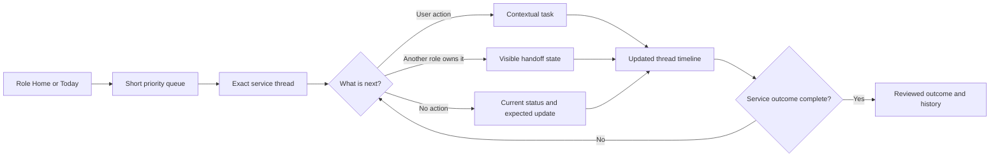
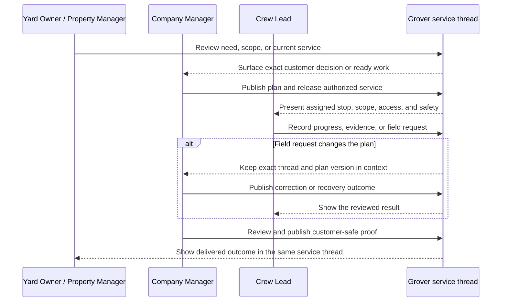

# Simplified Product Experience Plan

Status: active design direction

Product stage: post-MVP experience redesign

Last updated: 2026-09-08

## Outcome

Redesign the existing Grover product around a simpler user flow without
reducing it to an MVP feature set. The product already contains substantial
customer, planning, field, proof, recovery, administration, and rollout
capability. The design problem is that those capabilities have accumulated as
separate destinations and workflows, forcing users to reconstruct the service
story as they move between screens.

The new design will preserve approved capability and authority while making one
service outcome understandable from beginning to end.

## Relationship to earlier design work

This plan supersedes the “minimal-product” framing in the
[earlier workflow document](minimal-product-user-workflow.md). That document and
its [research session guide](minimal-product-workflow-session-guide.md) remain
useful research inputs, especially their evidence labels, interview prompts,
and handoff questions. They no longer define the product stage or imply that
Grover is still selecting an MVP feature set.

The completed ten-persona prototype remains broad design evidence. Dispatcher
and Crew Member are not part of the first simplified-workflow prototype, but
their current and future product capabilities are not deleted or declared out
of scope for the mature product.

## The simplification decision

Grover will organize work around a **service thread**, not around a collection
of feature destinations.

A service thread is the durable, role-filtered story of one customer outcome:

`need → scope/decision → scheduled service → field work → reviewed proof → outcome`

Questions, approvals, plan versions, access changes, field requests, saved
evidence, proof, and recovery appear inside the affected service thread. Lists
and dashboards help users find a thread; they do not become separate places
where the user must rebuild its context.

## What changes and what stays

| Simplify | Preserve |
| --- | --- |
| Fewer top-level destinations | Existing authorized capabilities |
| One next action per service thread | Exact versions, immutable history, and audit |
| Contextual decisions and recovery | Persona and resource authorization |
| A shared lifecycle vocabulary | Customer-safe/provider-private separation |
| Queues that open exact work | Offline retention and conflict behavior |
| Progressive detail inside the thread | Product, privacy, billing, and role gates |

This redesign does not remove product capability merely to make a screen look
minimal. It changes where capability appears, how users enter it, and how the
next responsible person receives it.

## Experience model

The user should never need to visit one page to understand the work, another to
find its decision, and a third to discover whether the decision succeeded.

## Shared service-thread anatomy

Every persona sees a filtered form of the same conceptual structure:

1. **Identity** — property, customer-safe or provider work label, and exact
   service date/version.
2. **Current state** — one plain-language answer about what is happening.
3. **Next owner** — the person or role responsible for progress.
4. **Primary action** — one current action, or an explicit statement that no
   action is required.
5. **Essential context** — no more than the facts required for that action.
6. **Timeline** — accepted scope, plan/release, field progress, proof, and
   decisions shown at the viewer's authorized level.
7. **Contextual tools** — question, approval, plan correction, field request,
   proof review, or recovery only when relevant to this thread.
8. **Outcome** — reviewed completion or an explicit unresolved state.

## Simplified persona entry points

### Yard Owner

Primary navigation: **Home · Services · Account**

- Home answers what happens next and opens the current service thread.
- Services lists upcoming and completed threads; proof and recommendations live
  inside the relevant thread.
- Account contains property access, relationship, privacy, and notification
  controls only when supported.
- Proof, Approvals, Questions, and Concerns do not become unrelated global
  destinations.

### Property Manager

Primary navigation: **Overview · Properties · Account**

- Overview is an exception-first queue across authorized properties.
- A property opens its current service thread and concise history.
- Decisions and proof remain attached to the exact property/service version.
- Cross-property analysis appears only when it supports a real portfolio
  decision.

### Company Owner

Primary navigation: **Home · Operations · Customers · Team**

- Home contains business-readiness exceptions and responsible owners.
- Operational detail opens the affected service thread rather than duplicating
  a manager dashboard.
- Owner-only access, relationship, and team decisions remain distinct from
  daily coordination.

### Company Manager

Primary navigation: **Today · Work · Customers · Team**

- Today is a short queue of plan, service, customer, proof, and recovery items
  ordered by consequence.
- Work contains plans and service threads, not separate Schedule, Reports, and
  Recovery silos.
- Opening an item preserves customer impact, plan version, field state, proof,
  and the next responsible person in one context.
- Dispatcher work remains absorbed by the manager in the first design slice;
  a future scale view may separate it without changing the service-thread model.

### Crew Lead

Primary navigation: **Today · Saved · Account**

- Today combines the ordered route with the current stop emphasized.
- Opening a stop enters its service thread at the field-authorized level.
- Scope, access, safety, checklist, evidence, and field requests stay inside the
  stop rather than becoming separate destinations.
- Saved shows only device-held or conflicted work that requires recovery and
  returns directly to the affected stop.

### Administration and later roles

- Support enters an exact service thread only through an owned incident and
  purpose-bound access.
- Billing readiness opens the exact completed thread that lacks downstream
  evidence; it does not introduce invoice or payment capability.
- Dispatcher and Crew Member may later receive specialized queue views into the
  same service threads. They should not require a parallel information model.

## Cross-persona service flow

## Navigation reduction rules

1. A top-level destination must represent a recurring user intention, not an
   implementation module.
2. An item that always begins from a customer, property, service, job, or
   incident remains contextual to that object.
3. A queue selects work; the service thread completes it.
4. History remains inside the object unless cross-object comparison is a
   validated job.
5. Recovery returns to the affected work and never becomes an unexplained dead
   end.
6. Persona differences change information and authority, not the underlying
   lifecycle vocabulary.
7. One person holding multiple responsibilities may switch work context without
   seeing duplicated versions of the same service.

## Content hierarchy

Every primary screen should answer these questions in order:

1. Where am I and whose work is this?
2. What is happening now?
3. Do I need to act?
4. What information makes that action safe?
5. Who owns the next step?
6. Where can I see the history or recover a failure?

Status vocabulary should describe human consequences before system state. For
example, “Waiting for manager review” is more useful than “Pending,” and “Saved
on this device” is more truthful than “Offline.”

## State model

Each service thread must support:

| State | Required answer |
| --- | --- |
| Preparing | What information or decision is still needed? |
| Ready | Who can begin the next stage? |
| Scheduled/released | What exact work and version are authorized? |
| In progress | What is happening and what update comes next? |
| Waiting | Who owns the handoff and what remains unchanged? |
| Needs recovery | What failed, what was retained, and who can resolve it? |
| Delivered | What reviewed customer-safe outcome exists? |
| Closed/read only | Why can no further action occur? |
| Unavailable/inconsistent | What is withheld and what safe exit remains? |

## Success measures

The redesign should improve measurable comprehension rather than visual taste
alone:

- participant can identify the current state and next owner without opening a
  secondary destination;
- participant reaches the primary task with fewer context changes;
- participant does not confuse prototype, queued, published, and completed
  states;
- participant can predict the consequence before confirming an action;
- participant can recover from the highest-risk failure without losing the
  affected service context;
- participant can distinguish their authority from the next persona's;
- backtracking, wrong destinations, facilitator assistance, and duplicate data
  entry decrease; and
- the design retains keyboard, screen-reader, zoom, touch-target, outdoor, and
  intermittent-connectivity usability.

Baseline and target values will be set after the first current-product task
sessions. This document does not invent success percentages before evidence is
available.

## Design phases

### SX0 — Experience reset

State: delivered in this plan.

- Supersede the MVP framing.
- Preserve existing prototypes as broad reference, not the new design base.
- Establish the service-thread mental model and navigation reduction rules.
- Keep Dispatcher and Crew Member outside the first prototype slice without
  deleting their mature-product potential.

Exit: the redesign has one post-MVP outcome, one organizing model, explicit
non-goals, and a clean artifact boundary.

### SX1 — Core service-thread prototype

State: delivered as validated design direction.

- Build a clean-slate prototype for Yard Owner, Company Manager, and Crew Lead.
- Demonstrate the same service moving through customer decision, plan/release,
  field execution/request, proof publication, and customer outcome.
- Include one happy path and one recovery path.

Exit: the complete service story can be followed without switching among
separate approval, schedule, report, proof, and recovery products.

Delivered evidence:

- One exact Mesa Court service is available across Yard Owner, Company Manager,
  and Crew Lead perspectives and decision, release, field, and proof moments.
- Reviewers can follow explicit handoffs while each role retains filtered
  information and authority.
- Required radio or checkbox decisions, non-persistence confirmation, focus
  return, stable URLs, responsive navigation, overflow, and mobile action
  clearance pass automated browser validation.
- Desktop manager recovery plus mobile Yard Owner outcome and Crew Lead field-
  request captures are published in the design gallery.

### SX2 — Owner and portfolio extension

State: delivered as validated design direction; production adoption not started.

- Add Company Owner business-readiness entry and role overlap with Company
  Manager.
- Add Property Manager exception-first entry into the same service-thread
  model.
- Validate that neither persona creates a duplicate service record or lifecycle.

Exit: owner-level and portfolio-level breadth changes the queue and authorized
detail, not the core workflow.

Delivered evidence:

- Company Owner receives business readiness, accountable operating ownership,
  contained consequence, and outcome without plan-editing or field controls.
- Property Manager receives exact authorized-property decisions, customer-safe
  progress, and reviewed outcome without provider-private route or crew detail.
- Both perspectives retain the Mesa Court lifecycle and hand off to the exact
  Company Manager moment instead of creating parallel owner or portfolio
  records.
- Twenty perspective/moment combinations pass desktop, mobile, and narrow-phone
  validation; Company Owner desktop and Property Manager mobile captures are
  published in the design gallery.

### SX3 — Exceptions and advanced capability

State: delivered as validated design direction; production adoption not started.

- Add Support incident entry, no-role recovery, and product-gated billing
  readiness as contextual paths.
- Test plan conflicts, field connectivity, proof failure, ended access, and
  inconsistent authorization.
- Record where later Dispatcher or Crew Member specialization would attach.

Exit: advanced capability remains discoverable without returning to global
feature silos or widening authority.

Delivered evidence:

- Plan conflict retains Plan 8 until an exact reviewed resolution; connection
  interruption retains released scope and device-held progress; proof failure
  holds customer delivery without undoing field completion.
- Support begins with an owned incident, minimized service reference, and no
  standing access. Product-gated completion readiness exposes no invoice,
  payment, refund, ledger, or accounting action.
- Ended access renders a one-destination Team Member recovery view with no
  service data in the document. Inconsistent property authorization withholds
  the record and lifecycle rather than presenting a false empty state.
- Support and readiness return to the exact accountable Company Manager moment.
  A future Dispatcher specialization would attach at reviewed plan conflict;
  Crew Member attribution would attach within device-held field recovery. Both
  remain unnecessary to the core service-thread composition.
- Eight review paths pass desktop, mobile, and narrow-phone validation alongside
  the five core perspectives. Support desktop, offline mobile, and ended-access
  mobile captures are published in the design gallery.

### SX4 — Evidence-led refinement

State: next; requires moderated participant sessions.

- Run current-product and new-design task sessions with the same outcome
  prompts.
- Compare comprehension, context changes, wrong turns, completion, recovery,
  and perceived authority.
- Revise information architecture and content before visual polish.

Exit: observed evidence supports the simpler workflow and documents remaining
tradeoffs.

### SX5 — Visual system and production adoption

State: planned.

- Apply the mature Grover visual system after workflow validation.
- Define narrow React adoption slices by service-thread stage and persona.
- Map each slice to real APIs, authorization, persistence, telemetry, and
  regression evidence.

Exit: the new design can replace existing composition without a big-bang
rewrite or unsupported product promise.

## Non-goals

- Redefining Grover as an MVP or removing mature capability to reduce scope.
- Replacing production authorization with client-side persona selection.
- Combining customer-safe and provider-private data.
- Flattening Company Owner, Company Manager, and Crew Lead authority.
- Making every persona use identical navigation or density.
- Building Dispatcher or Crew Member specialization in the first prototype
  slice.
- Treating visual consistency as proof that the workflow is understandable.

## Immediate deliverables

1. A new dependency-free `simplified-service-thread` working prototype.
2. Yard Owner, Property Manager, Company Owner, Company Manager, and Crew Lead
   views of one exact illustrative service.
3. A shared lifecycle timeline and visible next-owner pattern.
4. One manager-reviewed field-change recovery loop.
5. Responsive desktop and phone captures.
6. Contextual plan-conflict, offline, proof-correction, Support, completion-
   readiness, ended-access, and authorization-mismatch paths.
7. Browser checks for navigation reduction, stable URLs, role filtering,
   required decisions, focus, protected-data absence, overflow, and mobile
   action clearance.
