# Yard Care Completion Event Timeline

Status: active workflow-design reference; timing assumptions require operating
validation

Related phase: SX4 — Evidence-led refinement

Last updated: 2026-09-09

## Purpose

Place every event currently considered in the simplified-product plan onto one
chronological yard-care lifecycle. The main line explains how an authorized
need becomes reviewed, customer-visible completion. Conditional branches show
where recovery, support, access, or product-gated capability can enter without
becoming a separate service story.

This timeline describes event order and ownership. Relative time bands are
planning assumptions, not customer promises or service-level agreements. Real
timing must be validated with yard owners, property managers, company operators,
and field crews before production adoption.

## Legend

| Label | Meaning |
| --- | --- |
| Expected | Part of the normal lifecycle for the applicable service |
| First service | Required when creating or activating a new relationship; recurring care may start later |
| Conditional | Appears only when a decision, change, conflict, failure, or question occurs |
| Product-gated | Considered in the plan but not authorized as current product behavior |
| Later specialization | Future role separation that must reuse this lifecycle rather than create another record |

## Timeline at a glance

```mermaid
flowchart LR
    A[Authorized account<br/>and property] --> B{Active service<br/>relationship?}
    B -->|No · first service| C[Provider connection<br/>assessment · proposal · activation]
    B -->|Yes · recurring care| D[Need or recurring<br/>service becomes due]
    C --> D
    D --> E[Exact scope or<br/>recommendation]
    E --> F{Customer decision}
    F -->|Question or revision| E
    F -->|Accepted exact version| G[Manager creates and<br/>releases exact plan]
    G --> H[Crew Lead reviews<br/>stop · access · safety]
    H --> I{Can work proceed<br/>as released?}
    I -->|No| J[Field request or<br/>plan conflict review]
    J --> G
    I -->|Yes| K[Perform yard care<br/>and retain progress]
    K --> L[Submit checklist<br/>photos · completion]
    L --> M{Provider review}
    M -->|Correction needed| N[Exact evidence<br/>correction]
    N --> M
    M -->|Approved| O[Publish immutable<br/>customer-safe proof]
    O --> P[Customer reviews<br/>delivered outcome]
    P --> Q[Closed read-only<br/>service history]

    K -. connection interrupted .-> R[Continue from released plan<br/>device-held work retained]
    R -. sync and reconcile .-> L
    P -. visit question .-> S[Contextual question<br/>provider response]
    Q -. product-gated .-> T[Completion readiness<br/>no financial action]
    Q -. planned .-> U[Appreciation and<br/>external review destinations]
```

## Relative operating timeline

`T0` means the actual start of field work. The ranges below make ordering
visible; they are not fixed lead times.

| Relative band | Expected events | Primary owner | Exit condition |
| --- | --- | --- | --- |
| Before the first service · variable | Account, property, provider relationship, assessment, exact proposal, activation, and responsible team become ready | Yard Owner or Property Manager; Company Owner/Manager | An authorized relationship exists and accepted work can enter planning |
| `T−7d` to `T−2d` · illustrative | Need or recurring service becomes due; current access, timing, and property context are checked; exact scope/version is prepared | Customer then Company Manager | Customer has one exact decision with its consequence |
| `T−48h` to `T−24h` · illustrative | Customer accepts, asks, or requests revision; acceptance receipt is retained; manager resolves scope loop | Customer and Company Manager | One exact accepted version exists; acceptance alone has not scheduled work |
| `T−24h` to `T−2h` · illustrative | Manager checks capacity, arrival window, access, safety, evidence requirements, route fit, and publishes one plan version | Company Manager | Exact work is scheduled and released to the assigned field lead |
| `T−2h` to `T0` · illustrative | Crew Lead receives the released stop, confirms device availability, sequence, access, safety, and evidence expectations | Crew Lead | The stop is safe and ready to start, or an exact field request is raised |
| `T0` | Arrival/customer-safe start event is recorded | Crew Lead/system | Work begins from the published plan |
| `T0` through service duration | Checklist work, progress, photos, add-on/exception requests, and offline retention occur inside the stop | Crew Lead | Released scope is complete or an unresolved exception prevents completion |
| Completion through provider review | Crew Lead submits completion; manager reviews checklist, exact plan, timing, and customer-safe photos | Crew Lead then Company Manager | Proof passes review or returns for one explicit correction |
| After provider review | Immutable customer-safe proof is delivered; customer sees completed scope and chronology | Company Manager/system | Customer can understand what was delivered and who owns any next response |
| After delivery | Exact-visit questions resolve contextually; service becomes read only when no action remains | Customer and provider | Closed service remains available in authorized history |
| Later or separately gated | Completion readiness, concerns/preferences, provider contact, appreciation, and external review destinations | Named product/operating owner | Separate product decision and implementation contract exists |

## Complete event ledger

### A. Access and relationship readiness

| ID | Event | Classification | Actor and visible result | Required retained truth |
| --- | --- | --- | --- | --- |
| YC-001 | User signs in and workspace access is resolved | Expected | System shows the authorized persona and scope | Server-derived access; no guessed role |
| YC-002 | Access has ended or is inconsistent | Conditional | Team Member receives account recovery, or Property Manager receives authorization review | No protected service/property record loads; safe exit remains |
| YC-003 | Customer identity and property are established | First service | Yard Owner/Property Manager confirms the authorized property | Property authority and privacy boundaries |
| YC-004 | Company and responsible team are ready | First service or when changed | Company Owner sees business readiness; Company Manager owns operation | Owner-only setup stays separate from daily coordination |
| YC-005 | Known provider connection or approved discovery begins | First service | Customer initiates a provider relationship | Consent and withheld-data boundary |
| YC-006 | Provider-specific disclosure is reviewed | First service, conditional by relationship | Customer controls what authorized provider receives | Append-only receipt and revocable current grant |
| YC-007 | Site assessment is selected and completed | First service when needed | Customer and provider establish the production facts needed to scope work | Customer-safe result separated from provider-private production basis |
| YC-008 | Provider publishes an exact proposal version | First service or changed scope | Customer receives scope, price, version, timing assumptions, and consequence | Immutable version; no silent overwrite |
| YC-009 | Customer accepts, declines, questions, or requests revision | First service or changed scope | Response remains attached to the exact proposal | Acceptance does not activate or schedule service |
| YC-010 | Accepted relationship is activated and operating owner assigned | First service | Provider confirms responsible organization/team and first-service readiness | Explicit activation boundary and assignment provenance |

Recurring care with an active relationship normally begins at YC-011. It must
not replay connection, disclosure, assessment, or activation unless an expired,
revoked, materially changed, or legally required state makes that event current
again.

### B. Need, scope, and customer decision

| ID | Event | Classification | Actor and visible result | Required retained truth |
| --- | --- | --- | --- | --- |
| YC-011 | A customer need is created or recurring care becomes due | Expected | Customer sees the service/property; manager receives scoped work | Exact customer/property/service identity |
| YC-012 | Current timing, access, preparation, and relevant property context are gathered | Expected | Customer provides only facts required for service | Customer-safe and provider-private detail remain separated |
| YC-013 | Company Manager prepares a recommendation or scope version | Expected | Customer receives one exact version | Author, version, scope, price if applicable, expiry, and consequence |
| YC-014 | Customer reviews the exact recommendation | Expected | One primary decision appears inside the service thread | No scheduling is implied before response |
| YC-015 | Customer asks a bounded pre-decision question | Conditional | Manager receives the exact service/version context | Question does not become an unrelated inbox thread |
| YC-016 | Customer requests a revision | Conditional | Manager creates a later version while prior versions remain readable | Prior decision/version history is immutable |
| YC-017 | Customer accepts the exact version | Expected before planned work | Acceptance receipt appears to both authorized sides | Accepted version is exact; acceptance still does not schedule |
| YC-018 | Customer declines or the recommendation expires | Conditional terminal/loop | Thread shows why no service will proceed, or returns to revised scope | No stale version can be released |

### C. Plan, schedule, and release

| ID | Event | Classification | Actor and visible result | Required retained truth |
| --- | --- | --- | --- | --- |
| YC-019 | Manager converts accepted scope into an operating plan | Expected | Provider sees route, work, capacity, and evidence requirements together | Accepted customer scope remains the production basis |
| YC-020 | Capacity, crew lead, arrival window, access, safety, and evidence are checked | Expected | Manager can explain whether release is safe; Company Owner sees only an elevated business consequence | All release requirements refer to the same version |
| YC-021 | Plan conflict is detected | Conditional | Plan remains held for manager review | Published plan remains unchanged |
| YC-022 | Manager resolves the conflict by revising, asking, or holding | Conditional | Exact customer/field consequence and next owner are visible | A proposed plan never silently replaces the published plan |
| YC-023 | Manager publishes the exact plan and releases service | Expected | Crew Lead receives only authorized released work | Plan version, publisher, assignment, and release time |
| YC-024 | Customer sees confirmed window and preparation | Expected | Customer sees customer-safe schedule, not route/crew operations | Internal capacity and route detail stay provider-private |
| YC-025 | Weather, timing, access, scope, crew, or route changes after release | Conditional | Manager keeps, revises, holds, reschedules, or cancels explicitly; customer receives only the relevant reason/window | Old field plan, customer consequence, and reason for replacement remain traceable |

A future Dispatcher may specialize YC-019 through YC-025 when operating scale
requires it. The Company Manager remains accountable in the current simplified
model, and the service thread does not change.

### D. Field readiness and yard care

| ID | Event | Classification | Actor and visible result | Required retained truth |
| --- | --- | --- | --- | --- |
| YC-026 | Crew Lead receives the ordered stop and released plan | Expected | Today emphasizes the current stop | Only assigned, field-authorized context loads |
| YC-027 | Crew Lead reviews property, scope, access, safety, and evidence requirements | Expected | Stop is ready or an exact request is created | Customer price/private history remain absent |
| YC-028 | Crew arrives and records a customer-safe start | Expected | Customer can see that care began without crew-private telemetry | Time and service identity |
| YC-029 | Access, site condition, scope, or requested add-on differs from the released plan | Conditional | Crew Lead records the exact condition without editing the plan | Existing plan and saved work remain unchanged |
| YC-030 | Crew Lead sends a field or add-on request | Conditional | Manager receives stop, plan, customer impact, and requested recovery | Sender, payload, time, acknowledgment, and recovery owner |
| YC-031 | Manager reviews and publishes the recovery result | Conditional | Crew Lead receives keep/revise/hold outcome | Only manager-authorized plan version changes |
| YC-032 | Crew performs the released yard-care tasks | Expected | Checklist progress stays inside the stop | Task authorship, timestamps, and current plan |
| YC-033 | Connection is interrupted | Conditional | UI states “Saved on this device” and permits safe continuation from released work | Last confirmed sync, device-held progress/photos, and no false server claim |
| YC-034 | Reconnection syncs or conflicts | Conditional | Exact retained work is acknowledged, reconciled, or held for recovery | No duplicate completion, lost evidence, or silent conflict resolution |
| YC-035 | Crew captures required evidence | Expected where required | Checklist, photos, materials/add-ons, and completion context are associated with the stop | Draft evidence remains provider-private |
| YC-036 | Released scope is completed | Expected | Crew Lead sees what is complete and what remains | Completion cannot bypass required work/evidence |

A future Crew Member may receive individually assigned portions of YC-032
through YC-035. Crew Lead coordination, route authority, and the service thread
remain intact.

### E. Submission, provider review, and proof delivery

| ID | Event | Classification | Actor and visible result | Required retained truth |
| --- | --- | --- | --- | --- |
| YC-037 | Crew Lead reviews and submits field completion | Expected | Manager receives checklist, photos, time, plan, and field outcome | Device-held originals remain until durable confirmation |
| YC-038 | Manager reviews completion against released scope | Expected | Provider sees draft evidence and customer-visible preview separately | Exact released plan and submitter remain attached |
| YC-039 | Evidence gap or unsafe photo is found | Conditional | Customer delivery is held without undoing completed work | Exact rejected item and reason; no partial-delivery claim |
| YC-040 | Manager requests a bounded correction | Conditional | Crew Lead receives the exact missing/replacement evidence | Existing completion and passing evidence remain retained |
| YC-041 | Corrected evidence is submitted and re-reviewed | Conditional loop | Review returns to the same completion package | Correction provenance and review history |
| YC-042 | Manager approves customer-safe proof | Expected | Completion package becomes ready for immutable delivery | Provider review decision and privacy/source checks |
| YC-043 | System atomically publishes delivered proof | Expected | Customer receives only reviewed checklist/summary/photos | Immutable snapshot, delivery time, exact visit authorization |
| YC-044 | Customer opens the delivered outcome | Expected customer close | Customer understands tasks, chronology, evidence, and provider | Draft/internal evidence remains absent |
| YC-045 | Customer asks about the exact visit | Conditional, currently bounded | Provider receives visit reference and customer-safe question | Conversation remains attached to this visit |
| YC-046 | Provider responds and customer sees resolution | Conditional | Next owner and unresolved state remain explicit | Response provenance and authorization |
| YC-047 | Service becomes closed/read only | Expected when no action remains | Authorized history preserves the final service story | No later event rewrites delivered proof |

### F. Contextual administration and later follow-ons

| ID | Event | Classification | Actor and visible result | Required retained truth |
| --- | --- | --- | --- | --- |
| YC-048 | Expected service event fails to reach an authorized user | Conditional | An owned Support incident receives a minimized service reference | No customer-private data or standing access |
| YC-049 | Support retries delivery, requests refresh, or requests purpose-bound temporary access | Conditional | Action stays inside incident scope and returns to accountable manager | Tenant, purpose, expiry, audit, and approval boundaries |
| YC-050 | Completion lacks a downstream account/evidence reference | Product-gated | Billing Administrator may see completion readiness only | No invoice, payment, refund, tax, ledger, or accounting authority |
| YC-051 | Yard Owner reports a concern, preference, or provider-contact need | Product-decision pending | Must remain distinct from a simple exact-visit question until response ownership is approved | No implied response promise or unsafe emergency channel |
| YC-052 | Yard Owner offers appreciation or a provider review | Planned backlog | Appreciation stays attributable to the delivered service if approved | Moderation, consent, provider visibility, and abuse handling decisions |
| YC-053 | Customer chooses an external review destination such as Google or Yelp | Planned external integration | Product may link outward after explicit customer choice | Platform policies, approved destination, no automatic posting or copied review |
| YC-054 | Recurring service becomes due | Expected for recurring care | A new service thread begins at YC-011 with relevant relationship facts carried forward | Prior delivered thread remains immutable |

YC-050 through YC-053 occur after the yard-care outcome and must not block proof
delivery or change whether YC-047 is complete. They are included because the
plan has considered them, not because they are authorized production promises.

## Event ordering invariants

These rules must remain true even if operating timing changes:

1. No service plan is released before an exact current scope is accepted or
   otherwise authorized.
2. Acceptance does not silently schedule, activate, or assign work.
3. Field work begins only from a published plan visible to the assigned field
   role.
4. A field request or proposed plan cannot mutate the published version.
5. Offline work states what is confirmed remotely and what remains only on the
   device.
6. Field completion and customer proof delivery are separate events.
7. Customer proof contains only reviewed, authorized, customer-safe evidence.
8. Correcting proof does not erase completed field work or passing evidence.
9. Questions, incidents, and recovery return to the affected service or exact
   accountable handoff.
10. Ended or inconsistent access prevents protected records from entering the
    document at all.
11. Closed service history is read only; recurring care starts another thread.
12. Billing readiness, appreciation, and external reviews never determine
    whether yard care itself is complete.

## Completion definition

Yard care is operationally complete when:

- the released scope was performed or an explicit unresolved outcome explains
  why it was not;
- checklist and required evidence were durably submitted;
- the provider reviewed the exact completion package;
- customer-safe proof was atomically delivered to the authorized customer;
- the current state and next owner are understandable; and
- no hidden field, proof, plan, authorization, or delivery conflict remains.

Customer review of the delivered outcome is the final experience step, but the
system must distinguish “proof delivered” from “customer opened proof.” A
customer who has not yet opened delivered proof does not make accurately
completed yard care appear unfinished.

## Timeline questions for SX4 sessions

Validate these before converting relative bands into operating promises:

1. How far before service do customers expect the exact scope and arrival
   window?
2. Which recurring services need an active customer decision each time?
3. What is the latest safe point to change access, scope, crew, or route?
4. When may a Crew Lead continue offline, and when must work stop?
5. How quickly must field requests and proof corrections be acknowledged?
6. Who reviews proof in an owner-operated company?
7. When does the customer consider care complete: departure, notification,
   delivered proof, or review of proof?
8. Which post-service question, concern, appreciation, or external-review event
   belongs in the same thread?

Record observed answers using the
[SX4 comparative study](simplified-product-experience-comparative-study.md).
Do not turn the illustrative time bands into SLAs until evidence, staffing, and
operational ownership support them.
