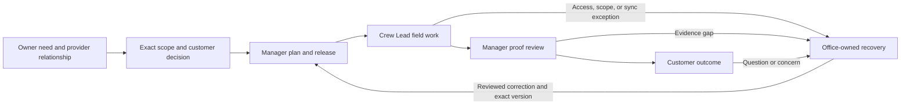

# Grover application experience blueprint

Status: first-pass design map; synthesized from repository contracts, not user
research or a claim that every transition is implemented

Date: 2026-09-16

## The experience to make legible

One property-service relationship should have one understandable story. Each
authorized person should be able to answer: **What is happening, what can I do,
and who is responsible next?** The first-wave perspectives are Yard Owner,
Property Manager, Company Owner, Company Manager, and Crew Lead. The
[critical review](application-workflow-critical-review-2026-09-16.md) explains
why the current app and modern concept need this shared map.

The diagram is a target service model. Actual API, access, and persistence
behavior must be checked at each transition before a design is adopted.

## Cross-role handoff map

| Moment | Person's first question | Responsible action and handoff | Record or truth that must remain visible | Failure branch to test |
| --- | --- | --- | --- | --- |
| Enter and connect | Yard Owner: “Can I begin privately, and who can see my yard?” Provider owner: “Am I creating a company, joining one, or answering an owner invitation?” | Owner creates a private brief and chooses an authorized connection; provider organization accepts or declines under the separate relationship boundary. | Owner-controlled property, exact disclosure grant, provider identity, invitation/assessment state. | Expired invitation, unverified recipient, declined connection, revoked disclosure. |
| Agree on work | Yard Owner or Property Manager: “What exactly am I deciding, for which property?” | Customer responds to the current proposal/recommendation; Company Manager receives the exact result and owns planning. | Property, scope, price when applicable, version, expiry, decision consequence; acceptance must not imply a scheduled visit. | Stale version, requested change, missing authorization, incomplete property context. |
| Prepare and release | Company Manager: “What can be released safely today?” Company Owner: “Is a business blocker mine to clear?” | Manager verifies accepted scope, crew fit, access, and plan version before release. Owner resolves only owner-level team/organization blockers. | Customer consequence, draft versus released plan, assigned crew, accountable manager, immutable version. | Plan conflict, inaccessible teammate, capacity gap, unpublished draft. |
| Do the work | Crew Lead: “Is this the released stop, and can I continue safely?” | Lead checks assignment/access/safety, records progress and evidence, and asks office to review a plan-changing issue. | Current service date, released plan, exact stop, device-held versus synced state, office response. | Offline save, replay conflict, access problem, safety concern, changed route. |
| Review proof | Company Manager: “Is the evidence correct and safe to deliver?” | Manager reviews/corrects the completion package and publishes customer-safe proof. | Completed field work, evidence status, corrections, delivery state; draft evidence stays private. | Photo processing failure, missing evidence, report correction, failed delivery. |
| Understand outcome | Yard Owner or Property Manager: “What was done, and what needs me next?” | Customer sees reviewed proof, may ask a contextual question or respond to a recommendation; provider owns the next update. | Delivered report, property/service identity, next decision, response expectation. | Unavailable protected read, ended access, concern, unanswered question. |

This map compresses the [54-event lifecycle](../../design/review/yard-care-completion-event-timeline.md)
for a review conversation. Its failure branches are drawn from the
[simplified service-thread proposal](../../design/review/simplified-product-experience-plan.md),
[SX4 tasks](../../design/review/simplified-product-experience-comparative-study.md), and
[owner connection design](../../design/review/yard-owner-entry-provider-connection-plan.md). The
[delivery plan](../../PLAN.md) remains the status source for what is live,
locally reviewable, prototype only, planned, or product gated.

## Screen contract for every handoff

An exact service view should expose these facts in this order, filtered by the
active person's authorization:

1. **Identity:** property or safe work label, service date, and exact version.
2. **Current state:** what is confirmed, pending, saved on device, or unknown.
3. **My role:** one allowed action or a clear statement that none is needed.
4. **Next owner and update:** a named role and expected event when known; no
   invented ETA or contact path.
5. **Context:** only facts needed for this decision, with history available
   inside the same service.
6. **Recovery:** the affected record and a real safe destination after failure.

Queues find an exact service. A queue item should not require a second tool
directory to reveal what is wrong. Company Owner sees the consequence and
accountable operator; Crew Lead sees released field context without customer
price; customers see no provider-private route or crew data.

## Current evidence and open work

| Evidence already prepared | What it establishes | What remains unknown |
| --- | --- | --- |
| [Dated current frontend audit](../../design/review/current-frontend-design-audit-2026-09-03.md) and local-review app | Rendered navigation and representative states; several earlier continuity fixes are delivered. | Whether real users understand the exact next action and handoff without help. |
| [Simplified service-thread prototype](../../design/prototypes/simplified-service-thread/README.md) | A connected, role-filtered composition for decision, release, field work, proof, and exceptions. | Whether it improves task completion, context retention, or recovery against the current app. |
| [Modern website concept](../../design/prototypes/modern-grover/README.md) and [personas](../../design/personas/README.md) | Public narrative, responsive visual direction, and explicit role hypotheses. | Correct entry path, truthful promise, real task behavior, and representative role language. |
| [SX4 study](../../design/review/simplified-product-experience-comparative-study.md) and [modern comparison guide](../../design/review/modern-website-comparison-guide.md) | Matched tasks, observation fields, stop rules, and adoption gates. | Participant observations; none have been collected. |

## Review sequence

1. Reconcile the public promise with delivered capabilities and choose the first
   audience to optimize for. Keep customer/provider and Property Manager entry
   choices testable rather than committing to a new menu from team preference.
2. Prepare two equivalent synthetic service records for current React and the
   service-thread design. Record commit, mode, viewport, network condition, and
   every known fixture limitation.
3. Ask representative people to complete the five core SX4 tasks from normal
   entry. Test the public path separately with MW-01/MW-02. Record first answer,
   wrong turns, context changes, version/authority accuracy, and recovery.
4. Mark each handoff above as **understood**, **confusing**, **unsafe**, or
   **unobserved**, with anonymous evidence IDs. Revise only the affected
   composition and run the task again.
5. Adopt one bounded production slice when its task result and API, access,
   persistence, offline, failure, and rollback contracts are ready.
