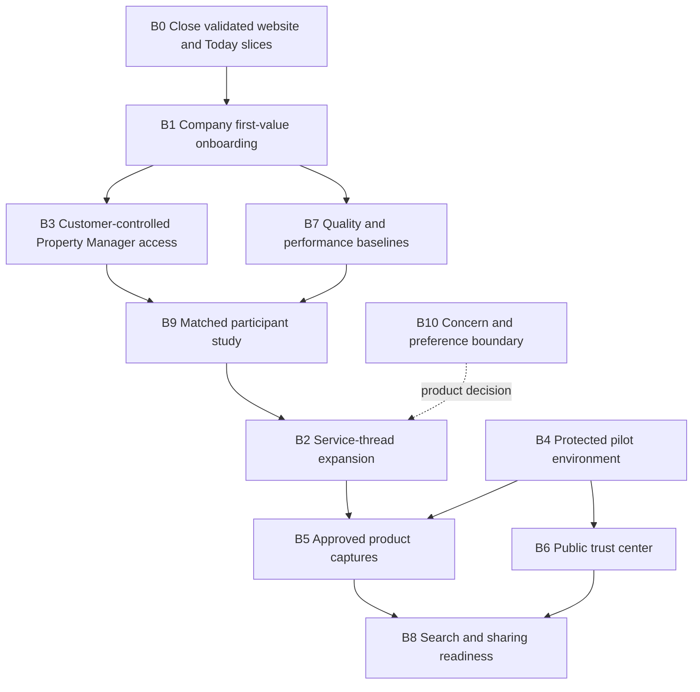

# Best-in-Class Product Delivery Plan

Status: approved for planning on 2026-10-01. This document defines the ordered
program for the ten product-quality initiatives approved by the product owner.
It does not claim that planned behavior is delivered or that protected hosting
is available.

The authoritative active phase remains
[`DELIVERY_BOARD.md`](DELIVERY_BOARD.md). This plan supplies scope, dependencies,
acceptance evidence, and rollout boundaries for that board.

## Product outcome

Grover should make one landscape-service outcome understandable from public
entry through company setup, planning, field execution, reviewed proof, and
customer follow-through. Every authorized person should be able to answer:

1. What is happening?
2. What can I do now?
3. Which exact record or version is authoritative?
4. Who owns the next handoff?
5. What happens when data, connectivity, or access is unavailable?

“Best in class” means faster orientation, trustworthy state, resilient field
work, clear authority, measurable activation, and supportable operations. It
does not mean adding every roadmap feature before a pilot.

## Program principles

- Keep landscaping company owners/managers as the primary public buyer and
  company setup as the primary conversion.
- Treat a property service—not a tool directory—as the unit connecting
  planning, field work, proof, decisions, and recovery.
- Never convert an unavailable or unauthorized read into an empty, successful,
  or all-clear state.
- Preserve exact versions, tenant scope, role authority, customer-safe
  projections, and device-held versus server-synced distinctions.
- Instrument product outcomes without collecting message bodies, addresses,
  customer names, evidence URLs, tokens, or other unnecessary personal data.
- Use representative fixtures and observed task evidence before broad visual or
  information-architecture adoption.
- Keep invoices, payments, open provider discovery, generalized vendor
  governance, and external reviews outside the launch promise until separately
  approved and delivered.
- A private review, simulation, CI run, or local fallback is never protected
  production evidence.

## Dependency map

B4 is an external lane and should proceed in parallel when its owning-account
inputs become available. B10 decision work can proceed in parallel, but no
concern feature may be implemented before the decision contract is approved.

## Execution sequence

| Order | Phase | State | Outcome |
| --- | --- | --- | --- |
| 0 | B0 — Current-slice closure | Implementation validated; commit blocked by read-only `.git` in the active sandbox | Preserve and commit the company-first website and Manager Today queue as two review units |
| 1 | B1 — Company first value | Implementation/package gates complete; browser and commit/push blocked by sandbox | A company can resume setup and reach its first published route and delivered report through one guided path |
| 2 | B3 — Property Manager access | Implementation/package gates complete; browser and commit/push blocked by sandbox | A customer can safely grant and revoke one-property access for a verified Property Manager recipient |
| 3 | B7 — Quality budgets | Repository contract and artifact baseline complete; protected runtime evidence pending | Measured frontend, API, accessibility, reliability, and offline baselines become release budgets |
| 4 | B9 — Participant evidence | Manifest safety contract complete; live seeding and sessions externally gated | Representative users complete matched entry and service tasks; findings gate broader adoption |
| 5 | B2 — Service-thread expansion | Evidence-gated after B9 | One exact service retains version, owner, next update, field state, proof, and recovery across roles |
| External | B4 — Protected pilot | Waiting on owning-account inputs | Cognito/PostgreSQL/S3/notification runtime passes authenticated and isolation smoke |
| 6 | B6 — Trust center | Internal content contract drafted; publication awaits protected facts and approvals | Public, plain-language security/privacy/recovery explanations match implemented behavior |
| 7 | B5 — Product captures | Planned after B2 and protected verification | Approved, reproducible product captures replace illustrative previews where appropriate |
| 8 | B8 — Search and sharing | Repository implementation delivered; final-origin deployment, preview/crawler, browser, and approved-content evidence remain gated | Audience pages are indexable, canonical, shareable, measurable, and protected routes remain excluded |
| Decision | B10 — Concern boundary | Decision packet prepared; owner/privacy/legal approval required | Ownership, privacy, response, retention, and escalation are approved before implementation |

## B0 — Close the current validated slices

### Outcome

Preserve the implemented Yard-Owner-focused homepage, dedicated audience
routes, and service-centered Manager Today queue as two narrow commits.

### Current evidence

- The single-property Yard Owner root hero, dedicated audience conversion
  hierarchy, secondary audience claim corrections, semantic landmarks, share
  metadata, and hero preloading are in the working tree.
- Company Owner and Company Manager Home have a bounded queue derived from
  authorized job and completion-report reads with exact Job/Report handoff.
- The complete frontend suite passes: 143 files and 588 tests. TypeScript and
  the production build pass. The final focused gate passes 25 tests.

### Blocker

The current managed session can write the working tree but reports `.git` as a
read-only filesystem and cannot create `.git/index.lock`. Do not reconstruct
Git metadata or combine the unrelated staged files to bypass this boundary.

### Exit evidence

- Commit 1 contains only the company-first website, claims/decision records,
  tests, and related delivery documentation.
- Commit 2 contains only the Manager Today queue, integration, tests, and
  related delivery documentation.
- The pre-existing `.gitignore`, mobile-offline E2E, local setup, and prompt
  files remain outside both commits.

## B1 — Company first-value onboarding

Delivery status: implementation complete in the working tree on 2026-10-01.
The full frontend and backend package gates pass. Prepared Chromium mobile and
desktop acceptance coverage remains unexecuted because the active sandbox
rejects the required loopback web-server bind with `EPERM`; commit/push also
remain blocked by read-only `.git`.

### Outcome

A new landscaping-company owner can understand setup, resume after interruption,
and move from public conversion to the first meaningful operating result without
needing repository knowledge or support intervention.

### Scope

- Connect the company-first CTA to the existing provider entry and first-owner
  bootstrap without losing approved campaign attribution.
- Present one resumable progress model for organization profile, first active
  crew, first customer/property, first published route, first completed service,
  and first delivered completion report.
- Name the current prerequisite, one primary action, and the next unlocked
  outcome at each stage.
- Distinguish loading, valid empty, missing access, conflict, unavailable,
  locally previewed, persisted, and complete states.
- Record privacy-minimized funnel events for stage view, start, success,
  recoverable failure, abandonment/resume, and first-value milestones.
- Provide a safe sample/demo explanation without presenting sample records as
  the new company’s persisted operation.

### Non-goals

- Pricing, subscription purchase, payment collection, automated data import,
  open marketplace enrollment, or fabricated setup completion.
- Granting roles or capabilities from client-side progress state.

### Acceptance evidence

- A fresh owner, returning partial owner, completed owner, missing-membership
  user, conflicting invitation, and persistence outage each receive a distinct
  tested path.
- Refresh and sign-out/sign-in preserve only server-confirmed progress.
- The first published route and first delivered report are tied to the created
  organization and cannot be satisfied by seed or another tenant’s data.
- Funnel telemetry contains stage identifiers and outcomes but no customer,
  property, note, token, or evidence content.
- Mobile and desktop browser journeys complete the path with keyboard and 200%
  text coverage.

### Measures

- Stage entry, completion, failure, and resume counts.
- Time and number of context changes from company setup start to first
  authoritative operating milestone.
- Exact failure categories rather than a single abandonment number.

### Rollout and rollback

Gate the composition independently from the underlying bootstrap APIs. Rollback
returns to the existing provider entry and first-owner checklist without
removing persisted organizations, memberships, crews, properties, routes, or
reports.

## B2 — Role-filtered service-thread expansion

### Outcome

One property service carries its understandable history across manager planning,
field execution, proof review, customer outcome, and recovery without becoming
a new source of authorization.

### Scope

- Extend the bounded Manager Today entry into an exact service header and
  chronological handoff view.
- Preserve property/service identity, scheduled date, immutable plan/report
  version, current state, allowed action, next responsible role, expected next
  event when known, and a real recovery destination.
- Compose existing day-plan, job, offline mutation, evidence, completion-report,
  notification, and operational-exception projections through typed adapters.
- Show role-filtered customer, manager, and Crew Lead views; do not serialize
  provider-private fields into customer payloads.
- Handle stale versions, changed access, missing data, offline saves, replay
  conflicts, evidence gaps, failed notification, and corrected proof.

### Non-goals

- A second workflow engine, cross-tenant activity stream, invented ETA, global
  customer messaging, Dispatcher role creation, or replacement of specialist
  administration tools.

### Dependencies

- B9 participant synthesis approves the affected composition.
- Every adopted handoff names its authoritative API, access rule, persistence
  behavior, failure state, telemetry, and rollback path.

### Acceptance evidence

- Matched Yard Owner, Company Manager, and Crew Lead tasks retain the exact
  service and version without a tool-directory detour.
- Property Manager and Company Owner see only their authorized summary and
  accountability facts.
- Browser and API tests cover every adopted transition plus unavailable,
  conflict, stale-version, and access-ended branches.
- Rollback removes the new composition while preserving all underlying records
  and queued field work.

## B3 — Customer-controlled Property Manager access

### Outcome

The customer can grant and revoke one-property access for a verified Property
Manager recipient after the provider relationship is active.

### Scope

- Implement the approved rules in
  [`../modern-grover/PROPERTY_MANAGER_ACCESS.md`](../modern-grover/PROPERTY_MANAGER_ACCESS.md).
- Add immutable invitation/grant identity, recipient verification, expiry,
  acceptance, revocation, audit, and exact property/provider-relationship scope.
- Require separate grants for separate properties; no implicit account-wide,
  organization-wide, or cross-customer access.
- Add Yard Owner grant/revoke UI, recipient acceptance, Property Manager access
  status, and explicit recovery for expired, changed, revoked, unavailable, and
  duplicate/conflicting requests.
- Remove protected portfolio details immediately when access ends.

### Non-goals

- Provider-granted customer access, multi-vendor governance, delegated grant
  administration by the Property Manager, bulk portfolio imports, or invoice
  visibility.

### Acceptance evidence

- PostgreSQL constraints and integration tests cover one-property scope,
  recipient binding, idempotency, concurrent duplicates, tenant isolation,
  revocation, and audit history.
- Browser tests prove customer initiation, verified recipient acceptance,
  authorized portfolio visibility, and immediate fail-closed removal.
- Logs and analytics omit invitation secrets and customer/property content.

### Rollout and rollback

Roll out reads before writes to a controlled cohort. Disabling issuance leaves
existing grants enforceable and revocable; rollback never broadens access.

## B4 — Protected pilot environment

### Outcome

The product runs behind managed identity with durable PostgreSQL, protected
photo storage, notification delivery, tenant isolation, monitoring, backups,
and rehearsed rollback.

### External prerequisites

- Render owning-account access and reconciled Blueprint/private database.
- AWS production account, temporary operator access, Terraform state decision,
  and approved Region/state values.
- Final HTTPS application origin and first owner identity.
- Controlled second tenant and persisted isolation fixture.
- Approved notification provider configuration and sender/recipient controls.

### Delivery sequence

1. Complete existing R2 Cognito, Render, PostgreSQL, identity, and fixture work.
2. Run R3 readiness, authentication, persistence, logout, unauthenticated
   rejection, exact cross-tenant denial, and rollback evidence.
3. Enable S3 evidence only after upload/read/delete and recovery queues pass.
4. Enable email/SMS only after webhook/provider validation, preferences,
   retries, dead-letter, and operational ownership pass.
5. Complete R4 logs, metrics, alert routing, backups, restore rehearsal, named
   incident owners, and rollback rehearsal.

### Exit evidence

- The protected evidence manifest identifies deployed commit, migration,
  authenticated smoke, tenant-isolation result, storage/notification modes,
  monitoring owners, backup/restore evidence, and distinct rollback target.
- No credential, access token, signed URL, object key, or customer data enters
  repository files or general logs.

## B5 — Approved product captures and proof

### Outcome

The public website demonstrates stable product behavior with reproducible,
approved visuals instead of relying on illustrative operational counts.

### Scope

- Create one internally consistent, non-customer demo organization spanning
  manager, Crew Lead, Yard Owner, and authorized Property Manager perspectives.
- Record fixture version, source commit, viewport, persona, rollout unit,
  service state, and capture date for every image or short recording.
- Capture company first value, Manager Today/service thread, field offline/sync,
  reviewed proof, and customer outcome only after their source behavior is
  stable.
- Remove names, addresses, IDs, tokens, browser extensions, diagnostics chrome,
  and unapproved claims from public artifacts.
- Retain “illustrative” labels for any preview that is not an exact production
  capture.

### Non-goals

- Fabricated testimonials, customer logos, outcome percentages, production PII,
  or implying that a local/private fixture is a hosted customer deployment.

### Acceptance evidence

- Artifact review maps every visible claim to a delivered capability and
  records approval owner/date.
- Responsive images have explicit dimensions, useful alt text where applicable,
  optimized formats, and measured page impact.
- Re-running the fixture/capture procedure reproduces the documented state.

## B6 — Public trust center

Delivery status: the internal claim-to-evidence and approval contract is
prepared in
[`../docs/public-trust-center-content-contract.md`](../docs/public-trust-center-content-contract.md).
No public route or protected-runtime claim is approved.

### Outcome

Prospective customers can understand how Grover handles identity, access,
customer-safe proof, offline data, recovery, privacy, and service availability
without security theater or unsupported promises.

### Scope

- Publish plain-language sections for role-scoped access, customer/provider data
  separation, device-held offline work, sync/conflict review, evidence storage,
  notification preferences, retention/erasure, outage behavior, and incident
  contact ownership.
- Link each statement to an internal implementation/runbook owner and review
  date; publish only statements supported by the protected configuration.
- State meaningful limitations, including what remains on-device, what is not
  end-to-end encrypted, which subprocessors/providers are enabled, and which
  recovery actions require an operator.
- Provide accessibility, privacy, and security-contact routes that actually
  reach an owned process.

### Non-goals

- Compliance badges, certifications, uptime promises, penetration-test claims,
  or legal guarantees that have not been independently established.

### Acceptance evidence

- Security, privacy, product, and operations owners approve every published
  statement against the protected environment.
- Automated link/metadata/accessibility checks cover the page.
- A dated review cadence and emergency correction owner are recorded.

## B7 — Measured quality and performance budgets

### Outcome

Release quality is judged by user-visible speed, accessibility, API behavior,
offline recovery, and operational reliability in addition to test counts.

### Scope

- Establish reproducible mobile and desktop baselines for navigation readiness,
  primary-content rendering, layout stability, interaction response, route/API
  latency, frontend errors, and failed/unavailable reads.
- Add privacy-minimized real-user measurements only after retention, sampling,
  consent/notice, and operational ownership are approved.
- Measure offline enqueue, replay, conflict, discard-after-review, and durable
  completion outcomes without recording mutation content.
- Define bundle/chunk, image, and request-count budgets from measured baselines;
  tighten only with evidence and document justified exceptions.
- Retain keyboard, semantic landmark, focus, contrast, reduced-motion, phone
  target, 200% text, and no-horizontal-overflow gates.
- Add API and worker service-level indicators for readiness, request outcomes,
  queue age, retries, dead letters, and persistence unavailability.

### Acceptance evidence

- A versioned budget file and validation command run locally and in CI.
- CI blocks clear regressions while reporting measurements in actionable units.
- Protected pilot dashboards and alerts have named owners and tested runbooks.
- Metrics use bounded labels and contain no tenant/customer/property/token/body
  dimensions.

## B8 — Search and sharing readiness

Delivery status: the initial-HTML renderer, exact-origin absolute metadata,
sitemap/robots generation, crawler exclusions, durable 404 behavior, and
remaining evidence contract are recorded in
[`../docs/search-sharing-readiness.md`](../docs/search-sharing-readiness.md).
Repository implementation is delivered; this is not complete production
search/share evidence.

### Outcome

Public audience pages can be discovered, indexed, shared, and measured while
authenticated, invitation, customer-link, and design-review routes remain out
of search results.

### Scope

- Pre-render or otherwise serve meaningful initial HTML for the company, Yard
  Owner, Property Manager, and Crew Lead public routes.
- Generate environment-correct absolute canonical and share URLs, approved
  social images, titles, descriptions, and structured product/organization data
  limited to verified facts.
- Add production-aware sitemap and robots policies; explicitly exclude
  authenticated app, callbacks, invitations, customer tokens, diagnostics, and
  review artifacts.
- Add durable not-found behavior and redirect rules for normalized campaign
  paths.
- Preserve first-party attribution and funnel measurement across public entry,
  company setup, and guided review.

### Non-goals

- Indexing protected content, doorway pages, keyword stuffing, fabricated local
  service areas, fake ratings, or publishing pricing that has not been decided.

### Acceptance evidence

- Built HTML contains the correct audience copy and metadata before client
  effects run.
- Crawler-policy tests prove public inclusion and protected-route exclusion.
- Link previews and canonical URLs pass in the final HTTPS environment.
- Accessibility and performance budgets pass for every public route.

## B9 — Matched participant study and adoption gate

### Outcome

Product structure and public entry decisions are based on observed task
performance rather than internal preference or polished sample data.

### Scope

- Use the prepared SX4 study and modern website comparison guide.
- Seed two equivalent, resettable service fixtures with matched scope, version,
  date, responsible roles, exception, proof state, and customer outcome.
- Include Yard Owner, Property Manager, Company Owner, Company Manager, and
  Crew Lead perspectives; use at least the participant coverage already defined
  by the study contract.
- Counterbalance current and candidate conditions and test public entry
  separately from authenticated service tasks.
- Record task completion, first answer, wrong turns, context changes,
  version/authority interpretation, recovery, confidence, and anonymized
  evidence IDs.
- Include a real supported phone and intermittent connectivity for the Crew
  Lead task.

### Safety and evidence rules

- Use synthetic data and stop on unexpected protected-data exposure, unsafe
  field interpretation, or participant distress.
- Report small-sample counts and conditions, not population percentages.
- Separate observation from interpretation and retain dissenting findings.

### Exit evidence

- Every targeted handoff is classified understood, confusing, unsafe, or
  unobserved with traceable anonymous evidence.
- Each proposed production composition receives keep, revise, or reject status.
- B2 scope includes only the approved task compositions and preserves the
  tested failure/authority constraints.

## B10 — Yard Owner concern and preference boundary

Decision status: a bounded recommended first-release contract is prepared in
[`B10_CONCERN_BOUNDARY_DECISION.md`](B10_CONCERN_BOUNDARY_DECISION.md). It is
not approved and does not authorize implementation.

### Outcome

Before Grover accepts general concerns or communication preferences, the
product has an explicit operating contract for who responds, what is retained,
what is private, and how urgent or out-of-scope issues are handled.

### Decisions required

- Owning provider role and backup owner.
- Response expectation and what happens when no responsible recipient exists.
- Allowed categories and the boundary between service concern, safety event,
  property-damage claim, billing dispute, access problem, and general message.
- Customer-visible versus provider-private content.
- Attachment/evidence rules, retention, correction, erasure, export, and audit.
- Escalation, closure, reopen, abusive-content, and emergency-language handling.
- Notification preferences and proof of delivery versus merely queued delivery.
- Appreciation and external-review destination eligibility and verification.

### Implementation gate

No concern form, free-form messaging, appreciation request, or external review
link ships until the decision record names product, support, privacy, legal,
and operational owners as applicable. After approval, implementation begins
with bounded categories and an exact service context; it does not begin as an
unscoped inbox.

### Acceptance evidence after approval

- Tenant-scoped persistence, lifecycle, audit, retention, privacy, delivery,
  unavailable/conflict, and escalation tests.
- Customer and manager interfaces name the responsible role and expected next
  event only when authoritative.
- Safety/billing/out-of-scope branches route to owned destinations without
  claiming Grover provides emergency response.

## Program scorecard

Every phase reports evidence in the same categories:

| Category | Required question |
| --- | --- |
| Activation | Can the intended user reach the first authoritative value and resume after interruption? |
| Orientation | Can the user state what is happening and choose the correct next action without help? |
| Authority | Is every action and field limited by server-derived role, tenant, relationship, and rollout scope? |
| Truth | Are persisted, queued, device-held, illustrative, unavailable, and completed states distinguishable? |
| Recovery | Does each failure preserve work where safe and lead to an owned, exact recovery path? |
| Accessibility | Does the flow remain semantic, keyboard usable, readable at 200%, and usable at supported phone widths? |
| Performance | Does it meet the approved measured budget on representative devices and networks? |
| Privacy | Is collected, displayed, logged, measured, and retained data minimized for the outcome? |
| Operations | Can an owner detect, triage, recover, and roll back the behavior? |
| Evidence | Is the conclusion supported by tests, task observations, or protected runtime records rather than inference? |

## Release milestones

### Milestone A — Evidence-ready company activation

B0, B1, B3, and B7 are complete. A company can reach first value, customer-
controlled Property Manager access works within exact scope, and quality is
measured against recorded baselines.

### Milestone B — Validated service experience

B9 is complete and B2 adopts only approved compositions. The same service and
version remain understandable across manager, field, customer, and recovery
perspectives.

### Milestone C — Protected pilot

B4 passes R2–R4 with managed identity, isolation, storage, delivery, monitoring,
backup/restore, and rollback evidence.

### Milestone D — Publication-quality public experience

B5, B6, and B8 are complete. Public claims, captures, trust explanations,
metadata, indexing, and performance are supported by the protected product.

### Milestone E — Responsible product expansion

B10 is decided and any concern implementation passes its own persistence,
privacy, operational-ownership, and recovery gates. Appreciation and external
reviews remain separately gated.

## Planning and delivery rules

- Activate only one repository implementation slice at a time; B4 can run in
  parallel because it is an external operator lane.
- Split each phase into reviewable commits that include implementation, tests,
  migrations, and delivery-record updates when they form one atomic change.
- Re-run the smallest useful gate during development, the complete affected
  package gate before commit, and the existing main/release gates before
  publication or protected deployment.
- Update [`PLAN.md`](../PLAN.md), [`DELIVERY_BOARD.md`](DELIVERY_BOARD.md),
  [`FEATURE_CATALOG.md`](FEATURE_CATALOG.md), and
  [`VERSION_HISTORY.md`](VERSION_HISTORY.md) only when state actually changes.
- Do not mark a phase delivered from a prototype, design review, uncommitted
  working tree, unavailable browser gate, or unverified hosted assumption.
